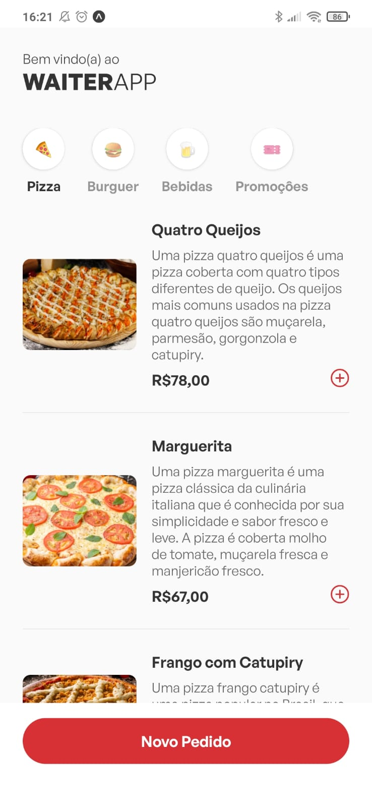
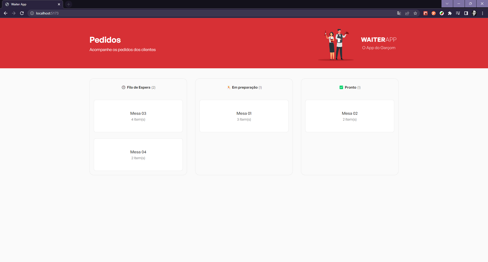

<h1 style="margin-bottom: 40px">Maratona JStack - WaiterApp</h1>

  
Projeto desenvolvido no evento gratuito Maratona JStack - WaiterApp, <a href="https://jstack.com.br/"> JStack</a>

  <h2 style="margin-top: 30px">🛠️ Tech Stack</h2>
  

  
Figma

  
HTML

  
CSS

  
Node

  
Typescript

  
MongoDB

  
Insomnia

  <h2 style="margin-top: 30px">👀 Preview</h2>
  

  
  

  

